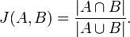

# Scalding Workshop

*Copyright (C) 2010-2014 Think Big Analytics, Inc. All Rights Reserved.*

[StrangeLoop 2012](http://thestrangeloop.com) 
**Dean Wampler, Think Big Analytics** 
[dean@deanwampler.com](mailto:dean@deanwampler.com) 
[@deanwampler](https://twitter.com/deanwampler) 
[Hire Us!](http://thinkbiganalytics.com)

This workshop/tutorial takes you through the basic principles of writing data analysis applications with [Scalding](https://github.com/twitter/scalding), a Scala API that wraps [Cascading](http://www.cascading.org/). I first went through this workshop at [StrangeLoop 2012](http://thestrangeloop.com). It took about 3 hours, but we didn't do all the *mini-exercises*, so it make take you a bit longer if you do them all.

These instructions walk you through a series of exercises. The exercises have a corresponding Scalding script (Scala source file). We use a convention of adding a number suffix to the name to indicate the order of the exercises. Note that some of these exercises are adapted from the Tutorial examples that are part of the Scalding Github repo, where noted.

This document will explain many features of the Scalding and Cascading. The scripts themselves contain additional details. The Scalding and Cascading documentation has more information than we can cover here:

* [Cascading Documentation](http://www.cascading.org/documentation/), especially the [Cascading User Guide](http://www.cascading.org/documentation/) and the [Javadocs](http://docs.cascading.org/cascading/2.0/javadoc/).
* [Scalding Wiki](https://github.com/twitter/scalding/wiki).
* Scalding Scaladocs are not online, but they can be built from the [Scalding Repo](https://github.com/twitter/scalding). For convenience, we have included these files in the workshop as `api.zip`. Unzip the file and open the [index](api/index.html).
* [Movie Recommendations](http://blog.echen.me/2012/02/09/movie-recommendations-and-more-via-mapreduce-and-scalding/) is a fantastic blog post with detailed, non-trivial examples using Scalding.
* [Scalding Example Project](https://github.com/snowplow/scalding-example-project) is a full example designed to run on Hadoop, specifically on Amazon's EMR (Elastic MapReduce) platform.

## A Disclaimer...

I'm not a Scalding or Cascading expert. Feedback welcome! [Fork me](https://github.com/ThinkBigAnalytics/scalding-workshop).

# Basic Cascading Concepts

Let's start with a very brief synopsis of key Cascading concepts useful for understanding Scalding. Not all Cascading features are wrapped with Scalding APIs. In some cases, equivalent Scala idioms are used, even though the implementations may delegate to Cascading equivalents. 

See the Cascading User Guide for more details.

## Tuple

A common data structure in many programming languages, a tuple is a grouping of a fixed number of fields, where each element has a specific type, the types of the different fields can be different and the fields can have names. It is analogous to a SQL record, a `struct` in C, and an object in object-oriented languages.

## Tap 

A **Tap** is a data *source* (for reading) or *sink* (for writing), corresponding to a file on the local file system, *Hadoop Distributed File System* (HDFS), or Amazon S3. You instantiate an `Hfs` instance for Hadoop or S3 file systems, and a `FileTap` instance for local file system. There are also more specialized versions for particular scenarios, like specifying a "template" for file or directory naming conventions.

## Scheme

The **Scheme** encapsulates the file format. There are several supported natively by Cascading. The corresponding Java class names are used in the following subsections.

### TextLine

When read, each line of text in the file is returned, with no attempt to tokenize it into fields. The position, byte offset or line number, in the file for the line is also returned. In the Hadoop model of key-value data pairs, the offset is the key and the line is the value.

When written, tuple fields are serialized to text and separated by tabs.

Available for both local file systems and Hadoop.

### TextDelimited

Handles data where each line is a tuple with fields separated by delimiters, such as tabs and commas. Quoted strings with nested delimiters and files with column headers can be handled. Fields can be cast to primitive types.

Available for both local file systems and Hadoop.

### SequenceFile

A binary, Hadoop-only data format.

### WritableSequenceFile

A more efficient implementation of SequenceFile.

## Pipe

**Pipes** are units of processing through which tuples are streamed. They are composed into **Assemblies**. Pipes are provided to merge and join streams, split them into separate streams, group them, filter them, etc.

## Flow

A **Flow** is created whenever a Tap is connected to a Pipe. Flows can also be composed.

## Cascade

A **Cascade** joins flows and supports a model where a flow is only executed if the target output doesn't exist is older than the input data, analogous to build tools like `make`.

# The Workshop

Each section introduces one or more features for data manipulation, most of which are analogous to features found in SQL, Pig (the Hadoop *data flow* tool), and other systems.

## Sanity Check

First, the [README](README.html) tells you to run a `SanityCheck0.scala` Scalding script as a sanity check to verify that your environment is ready to go.

Using `bash`: 

		cd $HOME/fun/scalding-workshop
		./run.rb scripts/SanityCheck0.scala

On Windows:

		cd C:\fun\scalding-workshop
		ruby run.rb scripts/SanityCheck0.scala

From now on, we'll assume you are working in the `scalding-workshop` directory, unless otherwise noted. Also, we'll just show the `bash` versions of the subsequent `run.rb` commands. Finally, because we're lazy, we'll sometimes drop the `.scala` extension from script names when we discuss them in the text.

Run these commands again and verify that they run without error. The output is written to `output/SanityCheck0.txt`. What's in that file?

It contains the contents of `SanityCheck0.scala`, but each line is now numbered.

> By default, when you create a new field in a **pipeline**, Cascading adds the field to the existing fields. All the fields together constitute a **tuple**.

Loading the file added the line number as an additional field.

## Projecting Fields

When you write a SQL `SELECT` statement like the following, you are *projecting* out the fields/columns or calculated values that you want, and discarding the rest of the fields. 

	SELECT name, age FROM employees;

Scalding also has a `project` method for the same purpose. Let's modify `SanityCheck0` to project out just the line we read from the file, discarding the line number. `Scripts/Project1.scala` has this change near the end of the file:

	in
	  .read
	  .project('line)
	  .write(out)

This expression is a sequence of Cascading [Pipes](http://docs.cascading.org/cascading/2.0/javadoc/cascading/pipe/Pipe.html). However, there is not `write` method defined on the `Pipe` class. Scalding uses Scala's *implicit conversion* feature to wrap `Pipe` with a Scalding-specific `com.twitter.scalding.RichPipe` type that provides most of the methods we'll actually use.

> There are also comments in this and other scripts about specific Scalding and Cascading features that we won't cover in these notes.

Run the script thusly:

		./run.rb scripts/Project1.scala
 
Now, if you look at the output in `output/Project1.txt`, you'll see just the original lines from `scripts/Project1.scala`. That is, running a `diff` command on the input and output files should show no differences.

## FlatMap and GroupBy - Implementing Word Count

This exercise introduces several new concepts and implements the famous *hello world!* of Hadoop programming: *word count*. In word count, a corpus of documents is read, the content is tokenized into words, and the total count for each word over the entire corpus is computed.

First, we'll use two new invocation command options:

* `--input file` specifies the input file.
* `--output file` specifies the output file.

> Unlike Hadoop's HDFS API, Hive, and Pig, when you run using `--local` mode, you can't specify a directory for the input, where all files will be read, or for the output, where one or more files will be written. You have to specify input and output files.

Run the script like this, where have wrapped lines and used `\\` in to indicate the line breaks:
	
	./run.rb scripts/WordCount2.scala \
		--input  data/shakespeare/plays.txt \
		--output output/shakespeare-wc.txt

The output should be identical to the contents of `data/shakespeare-wc/simple/wc.txt`. Using a `diff` command, should show no differences:

	diff data/shakespeare-wc/simple/wc.txt output/shakespeare-wc.txt

The script uses two new data transformation features to compute the word count.

### Further Exploration

Try these additional "mini-exercises" to explore what Scalding and Cascading are doing.

#### Improve the Tokenization

Look at the output and you'll notice that the tokenization is rather poor. How can you improve the value defined in `tokenizerRegex`? Can you pass in the regular expression as an argument to the program?

#### Project the 'num Field 

Instead of projecting out `'line`, project out `'num`, the line number. (The output is boring, but now you know the name of this field!)

### flatMap

When you apply a `map` operation to a collection, each element is passed to a function that returns a new element, perhaps of a completely different type. For example, mapping a collection of integers to a collection of their string representations. A crucial feature of `map` is that the process is *one-to-one*. Each input element has a corresponding output element and the sizes of the input and output collections are the same.

The `flatMap` operation is similar, but now the output of the function called for each element is a collection of zero or more new elements. These output collections from each function call are *flattened* into a single collection. So, a crucial difference compared to `map` is that the process is *one-to-many*, where *many* could be zero!

`WordCount2` uses `flatMap` to convert each line of input text into many words:

	.flatMap('line -> 'word){ 
		line : String => line.toLowerCase.split(tokenizerRegex)
	}

where `tokenizerRegex` is `"\\s+"`.

A bit of Scala syntax; there are *two* argument lists passed to `flatMap`. The first, `('line -> 'word)` specifies the field(s) in the tuple to pass to the mapping function, shown on the left-hand side of the arrow-like `->`, and it names the output field(s) the function will return, the single `'word` in this case.

The second function argument list is `{ line : String => line.toLowerCase.split(tokenizerRegex)}`. Scala lets you substitute curly braces `{...}` for parentheses `(...)` for function argument lists, which is most useful when the content of the "block-like" structure is a single *function literal* (a.k.a. *anonymous function*). 

The `line : String` is the argument list passed to the anonymous function, a single parameter named `line` of type `String`. On the right-hand side of the arrow-like `=>` is the body of the anonymous function. In this case it converts `line` to lower case and splits it on whitespace into an array of words.

### groupBy

Once we have a stream of individual words, we want to count the occurrences of each word. To do that, we need to group together all occurrences of the same words. The `groupBy` operation is used by `WordCount2` to do this. 

	.groupBy('word){group => group.size('count)}

The calling syntax is similar to `flatMap`. The first argument list specifies one or more fields to group over, forming the "key". The second argument is a function literal. It takes a single argument of type `com.twitter.scalding.GroupBuilder` that gives us a hook to the constructed group of words so we can compute what we need from it. In this case, all we care about is the size of the group, which we'll name `'count`.

### Further Exploration

Try these additional "mini-exercises" to explore what Scalding and Cascading are doing.

#### Remove the groupBy

Comment out the `groupBy` line so that the raw results of `flatMap` are written to the output instead of the word count output. Note the fields that are written. 

You'll see the line number, the whole line, and an individual word from the line. Note that the line number and line are repeated for each word in the line.

#### Group Again by Count

Now restore the `groupBy` line, and after it, add this line:

	.groupBy('count){ group => group.mkString('word -> 'words, "\t") }

The output lines will be extremely long at the beginning of the file, but very short at the end. This second `groupBy` regroups the `'word` and `'count` output from the previous pipe. It groups by count so we now have all the words with one occurrence on a line, followed by all the words with two occurrences, etc. At the end of the output, which words have the most occurrences? What are those "words"?

#### Improve the Word Tokenization

You probably noticed that simply splitting on whitespace is not very good, as punctuation is not removed. There are several ways it can be improved. First, replacing the definition of `tokenizerRegex`, which is `"\\s+"`, with `"\\W+"` will treat all runs of non-alphanumeric characters as word separators. This improves the result considerably (although it's still not perfect...).

For a more complete tokenizer, refactor `line.toLowerCase.split(tokenizerRegex)` into a `tokenize` function. Then implement `tokenize` to remove punctuation, etc. An example implementation can be found in the [Scalding README](https://github.com/twitter/scalding).

#### Eliminate Blank Lines

The very first line in the output is an empty word and a count of approximately 49,000! These are blank lines in the text. The implementation removes all other whitespace, but as written, it still returns an empty word for blank lines. Adding a filter clause will remove these lines. We'll see how below, but you can search for that section now if you want to try it.

## Input Parsing

Let's do a similar `groupBy` operation, this time to compute the average of Apple's (AAPL) closing stock price year over year (so you'll know what entry points you missed...). Also, in this exercise we'll solve a common problem; the input data is in an unsupported format.

Oddly enough, while there is a built-in `Tsv` class for tab-separated values, there is no corresponding `Csv` class, so we'll handle that ourselves.

	./run.rb scripts/StockAverages3.scala \
		--input  data/stocks/AAPL.csv \
		--output output/AAPL-year-avg.txt

You should get the following output (the input data ends in early 2010):

	1984    80      2.918625000000001       0.17609474544971507
	1985    253     2.3041501976284584      0.5150177183048612
	1986    253     3.7039130434782592      0.6311900614112455
	1987    253     8.90608695652174        1.9436409195268336
	1988    253     9.564703557312258       0.5662800839386863
	1989    252     9.684563492063495       0.9768865589941155
	1990    253     8.826126482213441       1.0871208010962554
	1991    253     12.469169960474305      1.66952305050656
	1992    254     13.130669291338577      1.7661116441071
	1993    253     9.920395256916992       3.1660729659295854
	1994    252     8.369880952380953       1.0934696061063884
	1995    252     10.075198412698407      1.0061968512619912
	1996    254     6.229881889763783       0.8162148485315347
	1997    253     4.491818181818182       0.7140447712304852
	1998    252     7.641666666666666       1.6581179568203712
	1999    252     14.443214285714282      5.433605126282854
	2000    252     22.856230158730177      8.415990854209504
	2001    248     10.109758064516127      1.2389205523420814
	2002    252     9.569920634920635       2.150379256336458
	2003    252     9.272619047619047       1.6510305480966423
	2004    252     17.763888888888886      6.577299642773537
	2005    252     46.67595238095237       11.4046392452893
	2006    251     70.81063745019917       9.507687243758655
	2007    251     128.2739043824701       35.17547139617391
	2008    253     141.9790118577075       33.66549448302255
	2009    252     146.81412698412706      39.731840611338804
	2010    25      204.7216        7.454055905344417

Note that as I write this (Septembe 2012), AAPL is currently trading at ~$700/share! [^sucks]

[^sucks]:But when I refined these notes in November 2012, the stock had corrected to ~$500/share! 

### Musical Interlude: Comparison with Hive and Pig

By the way, here's the same query written using *Hive*, assuming there exists a `stocks` table and we have to select for the stock symbol and exchange:

	SELECT year(s.ymd), avg(s.price_close) 
	FROM stocks s 
	WHERE s.symbol = 'AAPL' AND s.exchange = 'NASDAQ'
	GROUP BY year(s.ymd);

It's a little more compact, in part because we can handle all issues of record parsing, etc. when we set up Hive tables, etc. However, Scalding gives us more flexibility when our SQL dialect and built-in functions aren't flexible enough for our needs.

Here's what the corresponding *Pig* script looks like (see also `scripts/StockAverages3.pig`):

	aapl = load 'data/stocks/AAPL.csv' using PigStorage(',') as (
	  ymd:             chararray,
	  price_open:      float,
	  price_high:      float,
	  price_low:       float,
	  price_close:     float,
	  volume:          int,
	  price_adj_close: float);

	by_year = group aapl by SUBSTRING(ymd, 0, 4);

	year_avg = foreach by_year generate group, AVG(aapl.price_close);

	-- You always specify output directories:
	store year_avg into 'output/AAPL-year-avg-pig';

If you have *Pig* installed, you can run this script (from this directory) with the following command:

	pig -x local scripts/StockAverages3.pig

The `-x local` option means that Pig will treat the paths as references to the local file system, not the Hadoop Distributed File System (HDFS).

### Further Exploration

Try these additional "mini-exercises" to learn more.

#### Project Other Averages

Try projecting averages for one or more other fields.

#### Pig

If you have Pig installed, try the Pig script. Compare the performance of the Pig vs. Scalding script, but keep in mind that because we're running in local mode, the performance comparison won't mean as much as when you run in a Hadoop cluster.

#### Hive

If you have Hive installed, try the Hive query shown above. You'll need to create a table that uses the data files first. Compare the performance of the Hive vs. Scalding script, keeping in mind the caveats mentioned for Pig.

## Joins

Let's join stocks and dividend data. To join two data sources, you set up to pipe assemblies and use one of the join operations.

`scripts/StocksDividendsJoin4` performs an *inner join* of stock and dividend records. Let's invoke for Apple data (yes, although Apple only recently announced that it would pay a dividend, Apple paid dividends back in the late 80s and early 90s.):

	./run.rb scripts/StocksDividendsJoin4.scala \
	  --stocks data/stocks/AAPL.csv \
	  --dividends data/dividends/AAPL.csv \
	  --output output/AAPL-stocks-dividends-join.txt

Note that we need to input sources, we use flags `--stocks` and `--dividends` for them.

### Further Exploration

Try these additional "mini-exercises" to learn more.

#### Left Outer Join

Change `joinWithSmaller` to `leftJoinWithSmaller` to perform a left-outer join. (Also change the output file name to something else). You have to scroll a ways into file to find dividends. See also the next mini-exercise.

#### Filtering by Year

Sometimes you want to filter records, say to limit the output. Add the following filter clause to limit the records to 1988:

	.filter('symd){ ymd: String => ymd.startsWith("1988")}

Try moving it to different positions in the pipe assembly and see if the execution times change. However, the data set is small enough that you might not notice a difference.

#### Filtering Blank Lines from WordCount2

Recall in the `WordCount2` exercise that we had thousands of blank lines that got counted. Add a `filter` before the `groupBy` that keeps only those words whose lengths are greater than zero.

## CoGroups

CoGroups in Scalding are used internally to implement joins of two pipe assemblies. Clients can also use them to implement joins of three or more pipe assemblies, so-called *star joins*. You should always use the largest data stream as the first one in the join, because the Cascading implementation is optimized for this scenario. 

However, in this exercise, we'll do a four-way self-join of the data files for the four stocks symbols we provided, AAPL, INTC, GE, and IBM. 

For this script, the `--input` flag is used to specify the directory where the stocks files are located.

	run.rb scripts/StockCoGroup5.scala \
	  --input  data/stocks \
	  --output output/AAPL-INTC-GE-IBM.txt

When you look at the implementation, it is not obvious how to use the CoGroup feature. You could do pair-wise joins, which would be conceptually easier perhaps, but offer poor performance in a large MapReduce job, as each pair would require a separate MapReduce Job. The CoGroup feature tries to do as many joins at one as possible.

For comparison, here is the equivalent Hive join.

	SELECT a.ymd, a.symbol, a.price_close, b.symbol, b.price_close, 
	              c.symbol, c.price_close, d.symbol, d.price_close 
	      	      FROM stocks a 
	   	      JOIN stocks b ON a.ymd = b.ymd
	   	      JOIN stocks c ON a.ymd = c.ymd
	   	      JOIN stocks d ON a.ymd = d.ymd
	   	         a.symbol = 'AAPL' AND 
	   	         b.symbol = 'INTC' AND 
	   	         c.symbol = 'GE'   AND 
	   	         d.symbol = 'IBM'

Note that because `a.ymd` appears in all `ON` clauses, Hive will perform this four-way join in a single MapReduce job.

### Further Exploration

#### Star Joins, One Pair at a Time

Try implementing the same four-way join doing a sequence of pair-wise joins. Compare the complexity of the code and the performance of the join with the CoGroup implementation. The performance would be much slower in MapReduce, where each pair-wise join would require a separate MapReduce job.

## Splitting a Pipe

This exercise shows how to split a data stream and use various features on the splits, including finding unique values.

	run.rb scripts/Twitter6.scala \
	  --input  data/twitter/tweets.tsv \
	  --uniques output/unique-languages.txt \
	  --count_star output/count-star.txt \
	  --count_star_limit output/count-star-limit.txt

The output in `output/unique-languages.txt` is the following:

	\N
	en
	es
	id
	ja
	ko
	pt
	ru

There are seven languages and an invalid value that looks vaguely like a null! These "languages" are actually from messages in the stream that aren't tweets, but the results of other user-invoked actions.

The output in `output/count-star.txt` is a single line with the value 1000, the same as the number of lines in the data file. Similarly, `output/count-star-limit.txt` should have 100, reflecting the limit to the first 100 lines.

Note that the implementations use `groupAll`, then count the elements in the single group, via the `GroupBuilder` object. (The `count` method requires that we specify a field. We arbitrarily picked `tweet_id`.) 

By the way, this approach is *exactly* how Pig implements `COUNT(*)`. For example:

	grouped = group tweets all;
	count = foreach grouped generate COUNT(tweets);

Here, `tweets` would be the equivalent of a Pipe and `grouped` is the name of a new Pipe created by grouping all records together into one new record. The `foreach ... generate` statement iterates through this single record and projects the `COUNT` of the group contents (named `tweets` after the original relation).

Finally, note that we commented out the additional example using the `limit` feature. Unfortunately, there is a bug where running in local mode causes a *divide by zero* error. As we'll demonstrate later, this bug doesn't appear when running with Hadoop.

### Further Exploration

#### Debug Setting

Add the `debug` pipe to the pipe assembly. How does it change the console output? This is a very useful feature when you're learning or debugging problems.

#### Filter for Bad Languages

Add a `filter` method call that removes these "bad" records. **Hint:** You'll want to remove all tuples where the language value is `"""\N"""`. Without the triple quotes, you would have to write `"\\N"`.

## Compute NGrams

Let's return to the Shakespeare data to compute *context ngrams*, a common natural language processing technique, where we provide a prefix of words and find occurrences of the prefix followed by an additional word. The ranked most common `n` phrases are returned. 

	run.rb scripts/ContextNGrams7.scala \
	  --input  data/shakespeare/plays.txt \
	  --output output/context-ngrams.txt \
	  --ngram-prefix "I love" \
	  --count 10

Unfortunately, the data set isn't large enough to find a lot of examples for many possible ngrams.

### Further Exploration

#### Experiment with Different Prefixes

Try other prefixes of different lengths. You don't have to specify a two-word prefix!

#### Try Using Other Text Files

Run the script on other large text files you have.

#### NGram Detector

Context ngrams are special case of ngrams, where you just find the most common n-length phrases. Write a script to compute the most common ngrams. 

## Joining Pipes

Let's revisit the exercise to join stock and dividend records and generalize it to read in multiple sets of data, for different companies, and process them as one stream. A complication is that the data files don't contain the stock ("instrument") symbol, so we'll see another way to add data to tuples.

	run.rb scripts/StocksDividendsRevisited8.scala \
	  --stocks-root-path    data/stocks/ \
	  --dividends-root-path data/dividends/ \
	  --symbols AAPL,INTC,GE,IBM \
	  --output output/stocks-dividends-join.txt

# Matrix API

The Matrix API is relatively new and facilities many important machine learning algorithms.

## Jaccard Similarity and Adjacency Matrices

*Adjacency matrices* are used to record the similarities between two things. For example, the "things" might be users who have rated movies and the *adjacency* might be how many movies they have reviewed in common. Higher adjacency numbers indicate more likely similarity of interests. Note that this simple representation says nothing about whether or not they both rated the movies in a similar way.

Once you have adjacency data, you need a *similarity measure* to determine how similar to things (e.g., people) really are. One is *Jaccard Similarity*:

This is set notation; the size of the intersection of two sets over the size of the union. It can be generalized and is similar to the cosine of two vectors normalized by length. Note that the distance would be 1 - similarity.

Run the script this way on a small matrix:

	run.rb scripts/MatrixJaccardSimilarity9.scala \
	  --input data/matrix/graph.tsv \
	  --output output/jaccardSim.tsv

## Term Frequency-Inverse Document Frequency (TF*IDF)

TF*IDF is a widely used *Natural Language Processing* tool to analyze text. It's useful for indexing documents, e.g., for web search engines. Naively, you might calculate the *frequency* of words in a corpus of documents and assume that if a word appears more frequently in one document, then that document is probably a "definitive" place for that word, such as the way you search for web pages on a particular topic. Similarly, the most frequent words indicate the primary topics for a document.

There's a problem, though. Very common words, e.g., articles like "the", "a", etc. will appear very frequently, undermining results. So we want to remove them so how. Fortunately, they tend to appear frequently in *every* document, so you can reduce the ranking of a particular word if you *divide* its frequency in a given document by its frequency in *all* documents. That's the essence of TF*IDF.

For more information, see the [Wikipedia](http://en.wikipedia.org/wiki/Tf*idf) page.

Run the script this way on a small matrix:

	run.rb scripts/TfIdf10.scala \
 	  --input data/matrix/docBOW.tsv \
	  --output output/featSelectedMatrix.tsv \
	  --nWords 300

# Type-Safe API

So far, we have been using the original *Fields-Based API*, which emphasizes naming fields and uses a relatively dynamic approach to typing. This is consistent with Cascading's model.

There is newer, more experimental *Type-Safe API* that attempts to more fully exploit the type safety provided by Scala. We won't discuss it here, but refer you to the [Type-Safe API Wiki page](https://github.com/twitter/scalding/wiki/Type-safe-api-reference) for more information.

# Using Scalding with Hadoop

Now we'll use the `scripts/scald.rb` script in the Scalding distribution to a script as a Hadoop job. For example, assuming that you cloned the Scalding repo in a sister directory of the workshop directory, here is a command to run `HadoopTwitter11`, which is identical to `Twitter6` that we ran previously, except that we now use the `limit` method, which *won't* throw an exception when we run with Hadoop:

	../scalding/scripts/scald.rb --hdfs-local --host localhost \
	  scripts/HadoopTwitter11.scala \
	  --input            data/twitter/tweets.tsv \
	  --uniques          output/unique-languages \
	  --count_star       output/count-star \
	  --count_star_limit output/count-star-limit

On a laptop configuration using *pseudo-distributed* mode, use `localhost` for the Hadoop host name flag. Use the server name for the *JobTracker* master process when running on a real cluster. Note that the `--hdfs-local` option actually means use MapReduce, but ignore the *Hadoop Distributed File System* (HDFS). Instead, use the local file system like we have been doing. If we used the `--hdfs` option instead, all paths would be interpreted as relative to HDFS. The paths shown would be assumed to be relative to the user's home directory in HDFS, which is `/user/<name>`, by default.

Finally, the values specified for output using the `--uniques`, `count_star`, and `count_star_limit` flags will be interpreted as *directory*, not *file* names as previously. This follows conventional Hadoop practice, where the parallel processes might result in multiple, concurrently-written output files!

In this case, the `limit` method doesn't trigger an exception and each directory will contain two files, a `part-00000` file (partition number `00000`) that contains the data and a `.part-00000.crc` file that contains a CRC of the data file. With a larger data set and running on a real distributed cluster, instead of the *pseudo-distributed* mode you run on a single machine, there might be multiple files. The CRC file serves two purposes. First, it can be used to check for a corrupt data file and second, when it is written, processes watching the directory *know* that the process writing the corresponding data file has finished! This is important when sequencing processing tasks.

# Conclusions

## Comparisons with Other Tools

It's interesting to contrast Scalding with other tools.

### Cascading

Because Scala is a *functional programming* language with excellent support for DSL (domain-specific language) creation, using Scalding is much nicer than the Java-based Cascading itself, because Scalding programs are more concise and intuitive.

### Cascalog

This Clojure dialect written by Nathan Marz also benefits from the functional nature and concision of Clojure. Nathan has also built in logic-programming features from Datalog.

### Pig

Pig has very similar capabilities, with notable advantages and disadvantages.

#### Advantages

* *A custom language* - A purpose-built language for a particular domain can optimize expressiveness for common scenarios.
* *Type Safety* - Although Scala is strongly-typed, Cascading isn't, at least in the sense that you don't normally define the types of fields, except where necessary (e.g., to call math routines with numbers). Pig (like Hive) encourages specifying the type of every field.
* *Lazy evaluation* - you define the work flow, then Pig compiles, optimizes, and runs it when output is required. Scalding, following Scala, uses eager evaluation; each expression is executed as soon as it's parsed.
* *Describe* - The describe feature is very helpful when learning how each Pig statement defines a new schema. There is an API call, `fields` on Pipes to get the field names, but it's less convenient to use, especially in interactive scenarios.

#### Disadvantages

* *Not Turing complete* - You have to write extensions in other languages. By using Scala, Scalding lets you write everything in one language.
* *Slower* - At least for local jobs, Scalding (and Cascading) avoid Hadoop APIs completely and therefore run noticeably faster.

### Hive

Hive is ideal when your problem fits the SQL model for queries. It's less useful for complex transformations. Also, like Pig, extensions must be written in another language.

